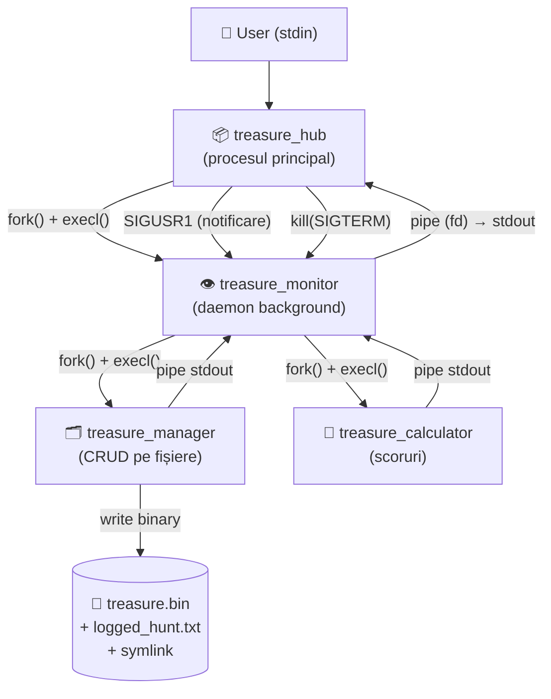

# 🏴‍☠️ Treasure Hunt — Analiză Tehnică Completă

> **Perspectivă recruiter tehnic**: Proiect de Systems Programming în C, demonstrând stăpânirea conceptelor de OS: procese, semnale, pipes, file I/O și structuri de date dinamice.

---

## 🏗️ Arhitectura Sistemului

Aplicația este compusă din **4 executabile independente** care comunică prin semnale UNIX și pipes:



---

## 🔄 Flow Logic Complet (pas cu pas)

### 1. Pornirea aplicației — `hub.c:main()`
```c
handle_sigchld();   // Linia 11 — instalează handler pentru zombie prevention
while(1) {
    write(1, "> ", 2);                          // Prompt fără buffering
    ssize_t bytes = read(0, command, ...);      // Linia 17 — read() direct, nu scanf/fgets
    command_type = get_command_type(command);   // Linia 28 — parsare command → enum
    execute_command(command_type, command);     // Linia 36 — dispatch
}
```
**De ce [read()](file:///c:/Users/daria/Documents/GitHub/Personal%20Projects/Treasure_Hunt/src/treasure_manager/Libraries/manage_argv/manage_argv.c#3-45)/`write()` în loc de `printf()`/`scanf()`?** — control explicit asupra buffering-ului, siguranță în signal handlers (async-signal-safe).

---

### 2. [start_monitor](file:///c:/Users/daria/Documents/GitHub/Personal%20Projects/Treasure_Hunt/src/treasure_hub/Hub/Libraries/hub_control/hub_control.c#53-101) — [hub_control.c](file:///c:/Users/daria/Documents/GitHub/Personal%20Projects/Treasure_Hunt/src/treasure_hub/Hub/Libraries/hub_control/hub_control.c)
```c
pipe(pipefd);                          // Linia 63  — creează canalul de comunicare
hub_monitor.monitor_pid = fork();      // Linia 70  — fork
if (pid == 0) {                        // copil (monitor)
    close(pipefd[0]);                  // Linia 78  — închide read-end în copil
    sprintf(write_fd, "%d", pipefd[1]);
    execl(TREASURE_MONITOR_EXEC, ..., write_fd, NULL); // Linia 83 — execl cu fd ca argument
}
// Părinte (hub)
fd_for_pipe = pipefd[0];              // Linia 93  — păstrează read-end global
close(pipefd[1]);                      // Linia 95  — hub nu scrie în pipe
hub_monitor.monitor_status = RUNNING;
```
**Modelul de comunicare**: Hub scrie comanda într-un fișier temp ([monitor_command.txt](file:///c:/Users/daria/Documents/GitHub/Personal%20Projects/Treasure_Hunt/monitor_command.txt)), trimite `SIGUSR1`, iar Monitor execută comanda și returnează output-ul prin pipe (fd transmis ca argv).

---

### 3. Trimiterea unei comenzi — `hub_control.c:send_command_to_monitor()`
```c
// Pasul 1: scrie comanda în fișier
int fd = open(COMMAND_FILE_PATH, O_WRONLY | O_CREAT | O_TRUNC, 0644); // Linia 12
write(fd, command, strlen(command));
close(fd);

// Pasul 2: notifică monitor prin semnal
kill(hub_monitor.monitor_pid, SIGUSR1);   // Linia 24 — "am o comandă pentru tine"

// Pasul 3: citește răspunsul din pipe (blocat până Monitor scrie)
ssize_t len = read(fd_for_pipe, buffer, sizeof(buffer) - 1);  // Linia 28
write(1, buffer, strlen(buffer));          // afișează utilizatorului
```

---

### 4. Monitor — Bucla de evenimente [monitor.c](file:///c:/Users/daria/Documents/GitHub/Personal%20Projects/Treasure_Hunt/src/treasure_hub/Monitor/monitor.c)
```c
volatile sig_atomic_t is_running = 1;  // Linia 19 — flag async-safe

while (1) {
    pause();               // Linia 38 — BLOCHEAZĂ procesul până vine un semnal
    if (is_running) {
        process_command(); // Linia 41 — execută comanda din fișier
        is_running = 0;    // resetează flag-ul
    }
}
```
**De ce `volatile sig_atomic_t`?** — variabila este modificată dintr-un signal handler. Compilatorul fără `volatile` ar putea să o optimizeze și să nu o recitească din memorie.

---

### 5. Monitor primește `SIGUSR1` — [monitor_signal_handler/signal_handler.c](file:///c:/Users/daria/Documents/GitHub/Personal%20Projects/Treasure_Hunt/src/treasure_hub/Monitor/Libraries/monitor_signal_handler/signal_handler.c)
```c
void handle_sigusr1(int signum) {
    if (signum == SIGUSR1) {
        is_running = 1;  // setează flag → main loop execută comanda
    }
}
```
**Instalare cu `sigaction`** (nu [signal()](file:///c:/Users/daria/Documents/GitHub/Personal%20Projects/Treasure_Hunt/src/treasure_hub/Monitor/Libraries/monitor_signal_handler/signal_handler.c#17-27)):
```c
sa.sa_flags = SA_RESTART | SA_NOCLDSTOP;
sigaction(SIGUSR1, &sa, NULL);
```
`SA_RESTART` — syscall-urile întrerupte (ex. [read](file:///c:/Users/daria/Documents/GitHub/Personal%20Projects/Treasure_Hunt/src/treasure_manager/Libraries/manage_argv/manage_argv.c#3-45)) se restartează automat.

---

### 6. Executarea comenzii — `monitor_commands.c:exec_treasure_manager()`
```c
pipe(pipe_fd);        // pipe pentru a captura output-ul managerului
pid_t pid = fork();
if (pid == 0) {       // copil
    close(pipe_fd[0]);
    dup2(pipe_fd[1], 1);  // Linia 22 — REDIRECTEAZĂ stdout → write-end pipe
    close(pipe_fd[1]);
    execl(TREASURE_MANAGER_EXEC, ..., command, hunt_id, NULL);
}
// Părinte (monitor) citește output-ul și îl scrie în output_fd_pipe (hub-ul citește de acolo)
while((bytes_read = read(pipe_fd[0], buffer, ...)) > 0) {
    write(output_fd_pipe, buffer, bytes_read);
}
waitpid(pid, NULL, 0); // elimină zombie
```

---

### 7. Treasure Manager — CRUD [treasure_manager.c](file:///c:/Users/daria/Documents/GitHub/Personal%20Projects/Treasure_Hunt/src/treasure_manager/treasure_manager.c)
Parsare argv → enum `Operation_T` → funcție specifică:

| Argument CLI | Operation | Funcție |
|---|---|---|
| `--add <hunt>` | `ADD_TREASURE` | [add_treasure()](file:///c:/Users/daria/Documents/GitHub/Personal%20Projects/Treasure_Hunt/src/treasure_manager/Libraries/manage_operations/add/add.c#4-99) |
| `--list <hunt>` | `LIST_TREASURE` | [list_treasure()](file:///c:/Users/daria/Documents/GitHub/Personal%20Projects/Treasure_Hunt/src/treasure_manager/Libraries/manage_operations/list/list.c#3-104) |
| `--view <hunt> <id>` | `VIEW_TREASURE` | [view()](file:///c:/Users/daria/Documents/GitHub/Personal%20Projects/Treasure_Hunt/src/treasure_manager/Libraries/manage_operations/list/list.c#105-193) |
| `--remove_treasure <hunt> <id>` | `REMOVE_TREASURE` | [remove_treasure()](file:///c:/Users/daria/Documents/GitHub/Personal%20Projects/Treasure_Hunt/src/treasure_manager/Libraries/manage_operations/remove/remove.c#3-133) |
| `--remove_hunt <hunt>` | `REMOVE_HUNT` | [remove_hunt()](file:///c:/Users/daria/Documents/GitHub/Personal%20Projects/Treasure_Hunt/src/treasure_manager/Libraries/manage_operations/remove/remove.c#134-188) |

**Structura datelor pe disc** (binar):
```c
typedef struct Treasure {
    char id[16];
    char userName[16];
    Coordonata_T GPSCoordinate;  // { float latitude; float longitude; }
    char clueText[128];
    int value;
} Treasure_T;
```
Fișierul `treasure.bin` este un **array binar contiguu** de `Treasure_T`. Accesul se face cu [read(fd, &treasure, sizeof(Treasure_T))](file:///c:/Users/daria/Documents/GitHub/Personal%20Projects/Treasure_Hunt/src/treasure_manager/Libraries/manage_argv/manage_argv.c#3-45).

---

### 8. Remove Treasure — Strategia "temp file" [remove.c](file:///c:/Users/daria/Documents/GitHub/Personal%20Projects/Treasure_Hunt/src/treasure_manager/Libraries/manage_operations/remove/remove.c)
```c
// Nu se poate șterge din mijlocul unui fișier binar → strategie copy-filter-rename
int temp_file = open("copy_treasure.bin", O_WRONLY | O_CREAT | O_TRUNC, 0644);

while (read(file, &treasure, sizeof(treasure)) > 0) {
    if (strcmp(treasure.id, id) != 0) {
        write(temp_file, &treasure, sizeof(treasure));  // copiază tot CE NU e de șters
    }
}
rename(temp_file_path, file_path);  // Linia 77 — atomic replace
// Dacă fișierul e gol după ștergere → unlink() + unlink(symlink)
```

---

### 9. Calculate Score — Lista înlănțuită [calculate_score.c](file:///c:/Users/daria/Documents/GitHub/Personal%20Projects/Treasure_Hunt/src/treasure_hub/Calculate_Score/calculate_score.c)
```c
List_Score_T get_or_create_node(List_Score_T list, const char *userName) {
    // caută user în lista existentă
    // dacă nu există → malloc() nod nou, insert la head
}

// Iterare binar → acumulare scor per user
while (read(fd, &treasure, sizeof(treasure)) > 0) {
    List_Score_T node = get_or_create_node(list, treasure.userName);
    node->totalScore += treasure.value;   // Linia 128
}
```

---

### 10. SIGCHLD Handler — Zombie Prevention [hub_signal_handler/signal_handler.c](file:///c:/Users/daria/Documents/GitHub/Personal%20Projects/Treasure_Hunt/src/treasure_hub/Hub/Libraries/hub_signal_handler/signal_handler.c)
```c
void on_sigchld(int signo) {
    int status;
    pid_t pid = wait(&status);
    // bucla cu WNOHANG — recoltează TOȚI copiii terminați
    while ((pid = waitpid(-1, &status, WNOHANG)) > 0) {
        if (pid == hub_monitor.monitor_pid) {
            hub_monitor.monitor_status = OFF;
        }
    }
    if (fd_for_pipe != -1) { close(fd_for_pipe); fd_for_pipe = -1; }
}
```

---

## 🔑 Linii de Cod Cheie (interviuri)

| Linie | Fișier | De ce e importantă |
|---|---|---|
| `hub.c:11` | [handle_sigchld()](file:///c:/Users/daria/Documents/GitHub/Personal%20Projects/Treasure_Hunt/src/treasure_hub/Hub/Libraries/hub_signal_handler/signal_handler.c#26-39) | Previne procese zombie înainte de orice fork |
| `hub.c:17` | [read(0, ...)](file:///c:/Users/daria/Documents/GitHub/Personal%20Projects/Treasure_Hunt/src/treasure_manager/Libraries/manage_argv/manage_argv.c#3-45) | I/O direct, fără stdio buffering |
| `hub_control.c:70` | `fork()` | Crearea procesului monitor |
| `hub_control.c:83` | `execl(...)` | Înlocuirea imaginii procesului cu monitorul |
| `hub_control.c:24` | `kill(pid, SIGUSR1)` | Notificare asincronă între procese |
| `monitor.c:38` | `pause()` | Blochează eficient CPU până vine semnal |
| `monitor.c:19` | `volatile sig_atomic_t` | Thread/signal safety pentru flag global |
| `monitor_commands.c:22` | `dup2(pipe_fd[1], 1)` | Redirecționare stdout → pipe |
| `signal_handler.c:32` | `SA_RESTART` | Evită întreruperea syscall-urilor de semnale |
| `remove.c:77` | `rename(temp, orig)` | Operație atomică de replace fișier |
| `calculate_score.c:33` | `malloc(sizeof(Nod_Score_T))` | Alocare dinamică nod listă |

---

## 🎯 Întrebări de Interviu

### 🔴 OS / Procese / Semnale
1. **Ce este un proces zombie și cum îl eviți în C?** — *Răspuns: `waitpid()` cu `WNOHANG` în handler `SIGCHLD` sau `wait()` explicit.*
2. **Care e diferența între `fork()` și [exec()](file:///c:/Users/daria/Documents/GitHub/Personal%20Projects/Treasure_Hunt/src/treasure_hub/Hub/Libraries/hub_commands/hub_commands.c#49-88)?** — *`fork()` dublează procesul, [exec()](file:///c:/Users/daria/Documents/GitHub/Personal%20Projects/Treasure_Hunt/src/treasure_hub/Hub/Libraries/hub_commands/hub_commands.c#49-88) înlocuiește imaginea procesului.*
3. **De ce folosești `SA_RESTART` în `sigaction()`?** — *Syscall-urile lente (ex. [read](file:///c:/Users/daria/Documents/GitHub/Personal%20Projects/Treasure_Hunt/src/treasure_manager/Libraries/manage_argv/manage_argv.c#3-45), `pause`) întrerupte de semnal returnează `EINTR` fără restart; cu `SA_RESTART` se reiau automat.*
4. **Ce face `pause()` și de ce e mai eficient decât un busy-wait?** — *Suspendă procesul fără consum de CPU până sosește orice semnal.*
5. **Explică diferența între `SIGTERM` și `SIGKILL`.** — *`SIGKILL` nu poate fi prins/ignorat, `SIGTERM` poate fi interceptat pentru shutdown graceful.*
6. **De ce `volatile sig_atomic_t` și nu [int](file:///c:/Users/daria/Documents/GitHub/Personal%20Projects/Treasure_Hunt/src/treasure_manager/Libraries/manage_argv/manage_argv.c#46-56) pentru `is_running`?** — *`volatile` previne optimizarea compilatorului; `sig_atomic_t` garantează că citirea/scrierea e atomică față de semnale.*
7. **Cum funcționează `dup2(pipe_fd[1], 1)`?** — *Duplică descriptorul `pipe_fd[1]` la `fd=1` (stdout); orice `printf/write(1,...)` merge în pipe.*

### 🟡 IPC / Pipes / File I/O
8. **De ce se închide capătul nefolosit al unui pipe?** — *Dacă write-end rămâne deschis în reader, [read()](file:///c:/Users/daria/Documents/GitHub/Personal%20Projects/Treasure_Hunt/src/treasure_manager/Libraries/manage_argv/manage_argv.c#3-45) nu returnează niciodată EOF. Vice-versa.*
9. **Ce se întâmplă dacă [read()](file:///c:/Users/daria/Documents/GitHub/Personal%20Projects/Treasure_Hunt/src/treasure_manager/Libraries/manage_argv/manage_argv.c#3-45) din pipe returnează 0?** — *Toți write-end descriptori sunt închiși — EOF, pipe capăt.*
10. **De ce stochezi treasures binar (nu text)?** — *Acces direct cu `lseek`, citire fixă cu `sizeof(Treasure_T)`, eficiență spațiu.*
11. **Cum ai implementa [remove_treasure](file:///c:/Users/daria/Documents/GitHub/Personal%20Projects/Treasure_Hunt/src/treasure_manager/Libraries/manage_operations/remove/remove.c#3-133) fără un temp file?** — *Cu `lseek()` și `ftruncate()` sau compactare în loc — dar e mai complex și mai riscant.*
12. **Ce este un symlink și de ce îl folosești în proiect?** — *Legătură simbolică la fișierul log ([logged_hunt-Hunt001](file:///c:/Users/daria/Documents/GitHub/Personal%20Projects/Treasure_Hunt/logged_hunt-Hunt001)). Permite acces rapid fără a cunoaște path-ul complet.*

### 🟢 C / Structuri de Date
13. **De ce `strncpy` și nu `strcpy` la inițializarea nodului?** — *`strcpy` nu limitează lungimea → buffer overflow; `strncpy` respectă `MAX_ID_LEN - 1` + null-terminator manual.*
14. **Există un memory leak în [calculate_all_scores()](file:///c:/Users/daria/Documents/GitHub/Personal%20Projects/Treasure_Hunt/src/treasure_hub/Calculate_Score/calculate_score.c#90-142)?** — *Da, dacă [get_or_create_node()](file:///c:/Users/daria/Documents/GitHub/Personal%20Projects/Treasure_Hunt/src/treasure_hub/Calculate_Score/calculate_score.c#20-49) re-inseră un nod nou (lista nu e actualizată corect când node != list). Pointer-ul la head poate fi pierdut.*
15. **Ce face `snprintf` în loc de `sprintf`?** — *Limitează scrierea la `n` caractere, prevenind buffer overflow.*

### 🔵 Design / Modificări (ce te pot pune să faci)
16. **Adaugă comandă [add_treasure](file:///c:/Users/daria/Documents/GitHub/Personal%20Projects/Treasure_Hunt/src/treasure_manager/Libraries/manage_operations/add/add.c#4-99) prin Hub** — necesită IPC bidirecțional și gestiunea stdin în procesul Monitor.
17. **Fă [calculate_score](file:///c:/Users/daria/Documents/GitHub/Personal%20Projects/Treasure_Hunt/src/treasure_hub/Hub/Libraries/hub_control/hub_control.c#162-171) să afișeze topul sortat descrescător.** — modifici [print_scores()](file:///c:/Users/daria/Documents/GitHub/Personal%20Projects/Treasure_Hunt/src/treasure_hub/Calculate_Score/calculate_score.c#143-150) să sorteze lista înlănțuită (ex. bubble sort pe nod->totalScore).
18. **Ce s-ar întâmpla dacă ai înlocui pipe cu un shared memory segment?** — mai rapid fără copiere kernel, dar necesită sincronizare explicită (mutex/semaphore).
19. **Hub-ul poate da [start_monitor](file:///c:/Users/daria/Documents/GitHub/Personal%20Projects/Treasure_Hunt/src/treasure_hub/Hub/Libraries/hub_control/hub_control.c#53-101) de mai multe ori? Cum îl protejezi?** — [is_monitor_running()](file:///c:/Users/daria/Documents/GitHub/Personal%20Projects/Treasure_Hunt/src/treasure_hub/Hub/Libraries/hub_control/hub_control.c#45-52) verifică `hub_monitor.monitor_status == RUNNING`.
20. **Cum ai face sistemul să suporte mai multe monitoare simultan?** — array de `Hub_Monitor_T` + multiplexare cu `select()`/`epoll()` pe pipe-uri.

---

## ⚠️ Bug-uri & Potențiale Probleme (bonus la interviu)

| Problemă | Locație | Explicație |
|---|---|---|
| **Memory leak** | [calculate_all_scores()](file:///c:/Users/daria/Documents/GitHub/Personal%20Projects/Treasure_Hunt/src/treasure_hub/Calculate_Score/calculate_score.c#90-142) (linia 132) | Logica de move-to-front este incompletă; noul nod poate deveni head dar list pointer nu e întotdeauna actualizat |
| **Race condition** | [send_command_to_monitor()](file:///c:/Users/daria/Documents/GitHub/Personal%20Projects/Treasure_Hunt/src/treasure_hub/Hub/Libraries/hub_control/hub_control.c#11-44) — fișier temp | Dacă Hub trimite 2 comenzi rapid, Monitor poate citi comanda greșită |
| **Buffer size fix** | `hunt_id[10]` în `monitor_commands.c:150` | Un hunt_id mai lung de 9 caractere provoacă overflow |
| **`exit(0)` în child după `execl` fail`** | *corect* | Bun pattern: child-ul nu trebuie să execute codul parent-ului |
| **`wait()` redundant în [on_sigchld](file:///c:/Users/daria/Documents/GitHub/Personal%20Projects/Treasure_Hunt/src/treasure_hub/Hub/Libraries/hub_signal_handler/signal_handler.c#3-25)** | `signal_handler.c:5` | `wait()` apelat înainte de `waitpid()` cu `WNOHANG` poate fura statutul altui copil |
| **Makefile `clean` incomplet`** | `makefile:47-50` | Șterge doar `treasure_manager`, nu și celelalte executabile |
